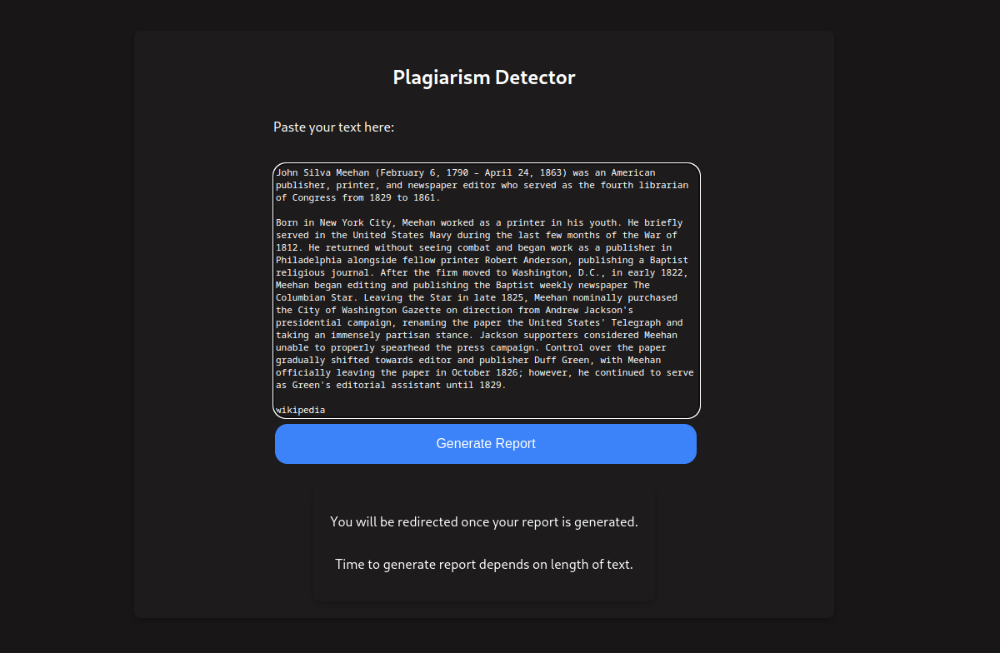
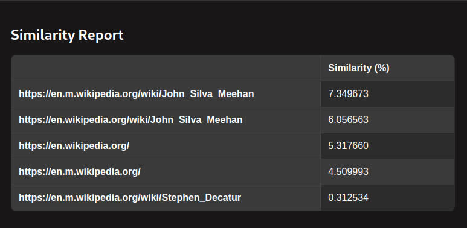

# Plagiarism Detection with Python





Finds percentage similarity between inputted text and relevant articles on the web.

## How to install?

1. Clone repository:

```
git clone https://github.com/harirakul/Plagiarism-Detection.git
```

2. Create and activate venv:

```
python3 -m venv venv
. venv/bin/activate
```

3. Install requirements:

```
pip install -r requirements.txt
```

4. Rename `.env.dist` to `.env`.

> For better work you need fill `COOKIE` in `.env`. You can grab on dev tools in your browser.

4. Start web-app:

```
python3 main.py
```

## Website Link:
http://plagiarism-detection--hariambethkar.repl.co/

## How To:
- Click on the link to the website
- Enter or paste your text in the input field
- Click on `Generate Report`
